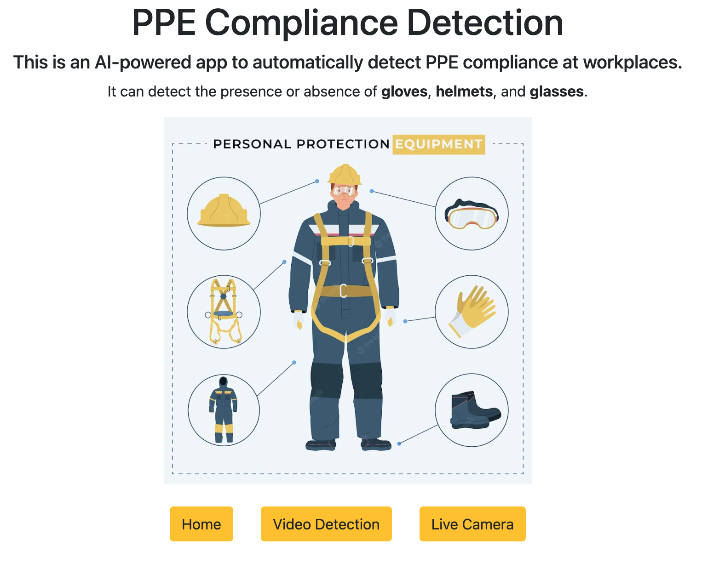

# Project: PPE Compliance Detection System

## Contributors:
* Thien An Trinh
* Roman Burekhin
* Athira Devan
* Lester Azinge
* Narjes Amousoltani
* Tina Khazaee
* Kamryn Edwards

## Overview
This project involves training, evaluating and deployment of a PPE detection system. 

The algorithm can detect the presence or absence of: `Helmet`, `Glasses`, `Gloves`.

## App usage
1. Run the Flask app locally (or on cloud).

2. The homepage provides a brief description of the app's functionalites and the categories it can classify.  

3. Navigate to the *Video Detection* page by clicking on the **Video Detection** button. On the page, upload a video.

4. Click the **Detect** button to run the detection algorithm on the uploaded video. The result video will be saved to `detection` folder.

5. Navigate to the *Live Camera* page by clicking on the **Live Camera** button. The webcam camera will turn on and the algorithm will run instantly.

## Additional information
* Python version: 3.10
* SSL error on Mac: open a terminal and run `/Applications/Python\ 3.10/Install\ Certificates.command`

### Enjoy using the PPE Compliance Detection App!
